Peek under the hood of the three popular regularization methods to find out how they can improve your models.
-------------------------------------------------------------------------------------------------------------

In this tutorial, you will get acquainted with the bias-variance
trade-off problem in linear regression and how it can be solved with
regularization. We will cover both mathematical properties of the
methods as well as practical R examples, plus some extra tweaks and
tricks. Without further ado, let's get started!

Bias-Variance Trade-Off in Multiple Regression
----------------------------------------------

Let's kick off with the basics: the simple linear regression model, in
which you aim at predicting *n* observations of the response variables,
*Y*, with a linear combination of *m* predictor variables, *X*, and a
normally distributed error term with variance *σ*2:

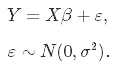

As we don't know the true parameters, *β*, we have to estimate them from
the sample. In the Ordinary Least Squares (OLS) approach, we estimate
them as $\\hat\\beta$ in such a way, that the sum of squares of
residuals is as small as possible. In other words, we minimize the
following loss function:

in order to obtain the infamous OLS parameter estimates,
$\\hat\\beta\_{OLS} = (X'X)^{-1}(X'Y)$.

In statistics, there are two important characterstics of estimators to
be considered: the bias and the variance. The bias is the difference
between the true population parameter and the expected estimator:

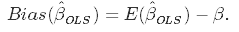

 It measures the accuracy of the estimates. Variance, on the other hand,
measures the spread, or uncertainty, in these estimates. It is given by

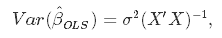

 where the unknown error variance *σ*2 can be estimated from
the residuals as

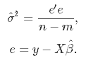

 This graphic illustrates what bias and variace are. Imagine the middle
point is the true population parameter that we are estimating, *β*, and
the shots at it are the values of our estimates resulting from four
different estimators - low bias and variance, high bias and variance,
and the combinations thereof.

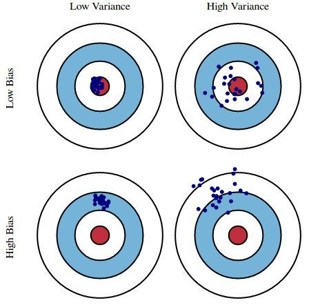

Source: kdnuggets.com

Both the bias and the variance are desired to be low, as large values
result in poor predictions from the model. In fact, model's error can be
decomposed into three parts: error resulting from large variance, error
resulting from large bias, and the remainder - the unexplainable part.

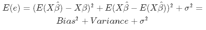

The OLS estimator has the desired property of being unbiased. However,
it can have a huge variance. Specifically, this happens when:

-   The predictor variables are highly correlated with each other;
-   There are many predictors. This is reflected in the formula for
    variance given above: if *m* approaches *n*, the variance approaches
    infinity.

The general solution to this is: **reduce variance at the cost of
introducing some bias**. This approach is called regularization and is
almost always beneficial for predictive performance of the model. To
make it sink in, let's take a look at the following plot.

Source: researchgate.net

As the model complexity, which in the case of linear regression can be
thought of as the number of predictors, increases, estimates' variance
also increases, but the bias decreses. The unbiased OLS would place us
on the right-hand side of the picture, which is far from optimal. That's
way we regularize: to lower the variance at the cost of some bias, thus
moving left on the plot, towards the optimum.

Ridge Regression
----------------

From the discussion so far we have concluded that we would like to
decrease the model complexity, that is the number of predictors. We
could use the forward or backward selection for this, but that way we
would not be able to tell anything about the removed variables' effect
on the response. Removing predictors from the model can be seen as
settings their coefficients to zero. Instead of forcing them to be
exactly zero, let's penalize them if they are too far from zero, thus
enforcing them to be small in a continuous way. This way, we decrease
model complexity while keeping all variables in the model. This,
basically, is what Ridge Regression does.

### Model Specification

In Ridge Regression, the OLS loss function is augmented in such a way
that we not only minimize the sum of squared residuals, but also
penalize the size of parameter estimates, in order to shrink them
towards zero:

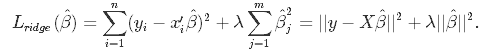

 Solving this for $\\hat\\beta$ gives the the rigde regression estimates
$\\hat\\beta\_{ridge} = (X'X+\\lambda I)^{-1}(X'Y)$, where *I* denotes
the identity matrix.

The *λ* parameter is the regularization penalty. We will talk about how
to choose it in the next sections of this tutorial, but for now notice
that:

-   As
    $\\lambda \\rightarrow 0, \\quad \\hat\\beta\_{ridge} \\rightarrow \\hat\\beta\_{OLS}$;
-   As
    $\\lambda \\rightarrow \\infty, \\quad \\hat\\beta\_{ridge} \\rightarrow 0$.

So, setting *λ* to 0 is the same as using the OLS, while the larger its
value, the stronger is the coefficents' size penalized.

### Bias-Variance Trade-Off in Ridge Regression

Incorporating the regularization coefficient in the formulas for bias
and variance gives us

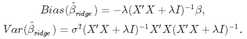

 From there you can see that **as *λ* becomes larger, the variance
decreases and the bias increases**. This poses the question: how much
bias are we willing to accept in order to decrease the variance? Or:
what is the oprimal value for *λ*?

### Choice of Regularization Parameter

There are two ways we could tackle this issue. A more traditional
approach would be to choose *λ* such that some information criterion,
e.g. AIC or BIC, is the smallest. A more machine learning-like approach
is to perform cross-validation and choose the value of *λ* that
minimizes the cross-validated sum of squared residuals (or some other
measure). The former approach emphasizes the model's fit to the data,
while the latter is more focused on its predictive performance. Let's
discuss both.

**Minimizing Information Criteria**

This approach boils down to estimating the model with many different
values for *λ* and choosing the one that minimizes the Akaike or
Bayesian Infromation Criterion:

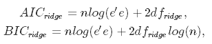

 where *d**f**r**i**d**g**e* is the number of degrees of
freedom. Watch out here! **The number of degrees of freedom in ridge
regression is different than in the regular OLS!** This is often
overlooked which leads to incorrect inference. In both OLS and ridge
regression, degrees of freedom are equal to the trace of the so-called
*hat matrix*, which is a matrix that maps the vector of response values
to the vector of fitted values as follows: $\\hat y = H y$.

In OLS, we find that
*H**O**L**S* = *X*(*X*′*X*)−1*X*, which gives
*d**f**O**L**S* = *t**r**H**O**L**S* = *m*, where
*m* is the number of predictor variables. In ridge regression, however,
the formula for the hat matrix should include the regularization
penalty:
*H**r**i**d**g**e* = *X*(*X*′*X* + *λ**I*)−1*X*,
which gives
*d**f**r**i**d**g**e* = *t**r**H**r**i**d**g**e*,
which is no longer equal to *m*. Some ridge regression software produce
information criteria based on the OLS formula. To be sure you are doing
things right, it is safer to compute them manually, which is what we
will do later in this tutorial.

**Minimizing cross-validated residuals**

To choose *λ* through cross-validation, you should choose a set of *P*
values of *λ* to test, split the dataset into *K* folds, and follow this
algorithm:

-   for p in 1:P:
-     for k in 1:K:
-      keep fold k as hold-out data
-      use the remaining folds and *λ* = *λ**p* to estimate
    $\\hat\\beta\_{ridge}$
-      predict hold-out data:
    $y\_{test, k} = X\_{test, k} \\hat\\beta\_{ridge}$
-      compute sum of squared residuals:
    *S**S**R**k* = ||*y* − *y**t**e**s**t*, *k*||2
-     end for k
-     average SSR over the folds:
    $SSR\_{p}=\\frac{1}{K}\\sum\_{k=1}^{K}SSR\_{k}$
-   end for p
-   choose optimal value:
    *λ**o**p**t* = *a**r**g**m**i**n**p**S**S**R**p*

Of course, no need to program it yourself - R has all the dedicated
functions.

### Ridge Regression: R example

In R, the *glmnet* package contains all you need to implement ridge
regresion. We will use the infamous mtcars data set as an illustration,
where the task is to predict miles per gallon based on car's other
characteristics. One more thing: **ridge regression assumes the
predictors are standardized and the response is centered!** You will see
why this assumption is needed in a moment. For now, we will just
standardize before modelling.

    # Load libraries, get data & set seed for reproducibility ---------------------
    set.seed(123)    # seef for reproducibility
    library(glmnet)  # for ridge regression
    library(dplyr)   # for data cleaning
    library(psych)   # for function tr() to compute trace of a matrix

    data("mtcars")
    # Center y, X will be standardized in the modelling function
    y <- mtcars %>% select(mpg) %>% scale(center = TRUE, scale = FALSE) %>% as.matrix()
    X <- mtcars %>% select(-mpg) %>% as.matrix()

    # Perform 10-fold cross-validation to select lambda ---------------------------
    lambdas_to_try <- 10^seq(-3, 5, length.out = 100)
    # Setting alpha = 0 implements ridge regression
    ridge_cv <- cv.glmnet(X, y, alpha = 0, lambda = lambdas_to_try, 
                          standardize = TRUE, nfolds = 10)
    # Plot cross-validation results
    plot(ridge_cv)

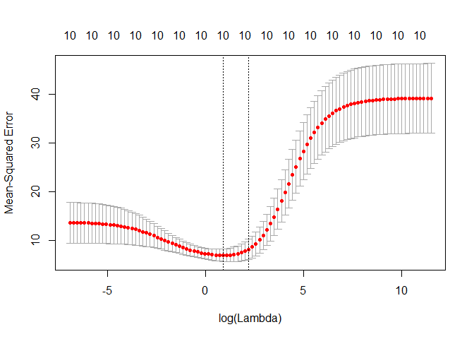

    # Best cross-validated lambda
    lambda_cv <- ridge_cv$lambda.min
    # Fit final model, get its sum of squared residuals and multiple R-squared
    model_cv <- glmnet(X, y, alpha = 0, lambda = lambda_cv, standardize = TRUE)
    y_hat_cv <- predict(model_cv, X)
    ssr_cv <- t(y - y_hat_cv) %*% (y - y_hat_cv)
    rsq_ridge_cv <- cor(y, y_hat_cv)^2

    # Use information criteria to select lambda -----------------------------------
    X_scaled <- scale(X)
    aic <- c()
    bic <- c()
    for (lambda in seq(lambdas_to_try)) {
      # Run model
      model <- glmnet(X, y, alpha = 0, lambda = lambdas_to_try[lambda], standardize = TRUE)
      # Extract coefficients and residuals (remove first row for the intercept)
      betas <- as.vector((as.matrix(coef(model))[-1, ]))
      resid <- y - (X_scaled %*% betas)
      # Compute hat-matrix and degrees of freedom
      ld <- lambdas_to_try[lambda] * diag(ncol(X_scaled))
      H <- X_scaled %*% solve(t(X_scaled) %*% X_scaled + ld) %*% t(X_scaled)
      df <- tr(H)
      # Compute information criteria
      aic[lambda] <- nrow(X_scaled) * log(t(resid) %*% resid) + 2 * df
      bic[lambda] <- nrow(X_scaled) * log(t(resid) %*% resid) + 2 * df * log(nrow(X_scaled))
    }

    # Plot information criteria against tried values of lambdas
    plot(log(lambdas_to_try), aic, col = "orange", type = "l", 
         ylim = c(190, 260), ylab = "Information Criterion")
    lines(log(lambdas_to_try), bic, col = "skyblue3")
    legend("bottomright", lwd = 1, col = c("orange", "skyblue3"), legend = c("AIC", "BIC"))

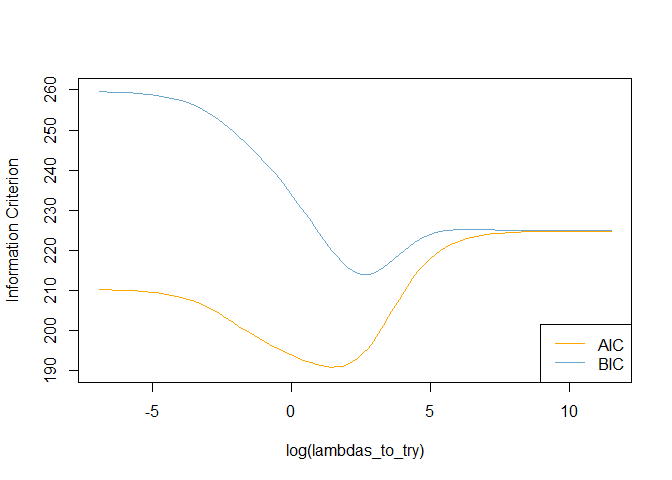

    # Optimal lambdas according to both criteria
    lambda_aic <- lambdas_to_try[which.min(aic)]
    lambda_bic <- lambdas_to_try[which.min(bic)]

    # Fit final models, get their sum of squared residuals and multiple R-squared
    model_aic <- glmnet(X, y, alpha = 0, lambda = lambda_aic, standardize = TRUE)
    y_hat_aic <- predict(model_aic, X)
    ssr_aic <- t(y - y_hat_aic) %*% (y - y_hat_aic)
    rsq_ridge_aic <- cor(y, y_hat_aic)^2

    model_bic <- glmnet(X, y, alpha = 0, lambda = lambda_bic, standardize = TRUE)
    y_hat_bic <- predict(model_bic, X)
    ssr_bic <- t(y - y_hat_bic) %*% (y - y_hat_bic)
    rsq_ridge_bic <- cor(y, y_hat_bic)^2

    # See how increasing lambda shrinks the coefficients --------------------------
    # Each line shows coefficients for one variables, for different lambdas.
    # The higher the lambda, the more the coefficients are shrinked towards zero.
    res <- glmnet(X, y, alpha = 0, lambda = lambdas_to_try, standardize = FALSE)
    plot(res, xvar = "lambda")
    legend("bottomright", lwd = 1, col = 1:6, legend = colnames(X), cex = .7)

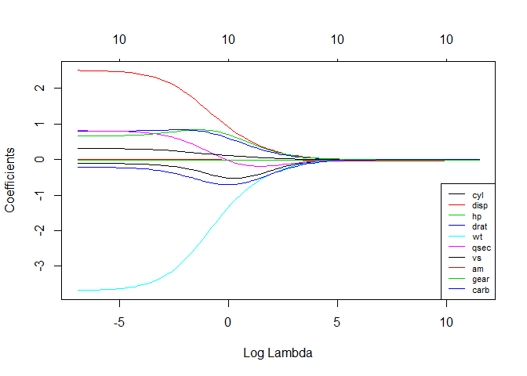

### Heteroskedastic Ridge Regression

I have mentioned before that ridge regression assumes the predictors to
be scaled to z-scores. Why is this required? This scaling ensures that
the penalty term penalizes each coefficient equally, so that it takes
the form $\\lambda \\sum\_{j=1}^m\\hat\\beta\_j^2$. If the predictors
are not standardized, their standard deviations are not all equal to
one, and it can be shown with some math that this results in a penalty
term of the form $\\lambda \\sum\_{j=1}^m\\hat\\beta\_j^2/std(x\_j)$.
So, the unstandardized coefficients are then weighted by the inverse of
the standard deviations of their corresponding predictors. We scale the
*X* matrix to avoid this, but... Instead of solving this
heteroskedasticity problem by equalizing the variances of all predictors
via scaling, we could just as well use them as weights in the estimation
process! This is the idea behind the *Differentially-weighted* or
*Heteroskedastic Ridge Regression*.

The idea is to penalize different coefficients with different strength
by introducing weigths to the loss funtion:

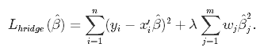

 How to choose the weights *w**j*? Run a set of univariate
regressions (resposne vs one of the predictors) for all predictors,
extract the estimate of the coeffcient's variance, $\\hat\\sigma\_{j}$,
and use it as the weight! This way:

-   $\\hat\\beta\_j$ of variables with small $\\hat\\sigma\_{j}$, thus
    little uncertainty in the estimate, are less penalized;
-   $\\hat\\beta\_j$ of variables with large $\\hat\\sigma\_{j}$, thus
    much uncertainty in the estimate, are heavily penalized.

Here is how to do this in R. As this method is not implemented in
*glmnet*, we would need a bit of programming here.

    # Calculate the weights from univariate regressions
    weights <- sapply(seq(ncol(X)), function(predictor) {
      uni_model <- lm(y ~ X[, predictor])
      coeff_variance <- summary(uni_model)$coefficients[2, 2]^2
    })

    # Heteroskedastic Ridge Regression loss funtion - to be minimized
    hridge_loss <- function(betas) {
      sum((y - X %*% betas)^2) + lambda * sum(weights * betas^2)
    }

    # Heteroskedastic Ridge Regression function
    hridge <- function(y, X, lambda, weights) {
      # Use regular ridge regression coefficient as initial values for optimization
      model_init <- glmnet(X, y, alpha = 0, lambda = lambda, standardize = FALSE)
      betas_init <- as.vector(model_init$beta)
      # Solve optimization problem to get coefficients
      coef <- optim(betas_init, hridge_loss)$par
      # Compute fitted values and multiple R-squared
      fitted <- X %*% coef
      rsq <- cor(y, fitted)^2
      names(coef) <- colnames(X)
      output <- list("coef" = coef,
                     "fitted" = fitted,
                     "rsq" = rsq)
      return(output)
    }

    # Fit model to the data for lambda = 0.001
    hridge_model <- hridge(y, X, lambda = 0.001, weights = weights)
    rsq_hridge_0001 <- hridge_model$rsq

    # Cross-validation or AIC/BIC can be employed to select some better lambda!
    # You can find some useful functions for this at https://github.com/MichalOleszak/momisc/blob/master/R/hridge.R

Lasso Regression
----------------

Lasso, or Least Absolute Shrinkage and Selection Operator, is quite
similar conceptually to ridge regression. It also adds penalty for
non-zero coefficients, but unlike ridge regression which penalizes sum
of squared coefficients (the so-called L2 penalty), lasso penalizes the
sum of their absolute values (L1 penalty). As a result, for high values
of *λ* many coefficients are exactly zeroed under lasso, which is never
the case in ridge regression.

### Model specification

The only difference in ridge and lasso loss funtions is in the penalty
terms. Under lasso, the loss is defined as:

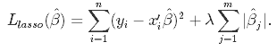

### Lasso: R example

To run Lasso Regression you can re-use the *glmnet()* function, but with
the *alpha* parametr set to 1.

    # Perform 10-fold cross-validation to select lambda ---------------------------
    lambdas_to_try <- 10^seq(-3, 5, length.out = 100)
    # Setting alpha = 1 implements lasso regression
    lasso_cv <- cv.glmnet(X, y, alpha = 1, lambda = lambdas_to_try, 
                          standardize = TRUE, nfolds = 10)
    # Plot cross-validation results
    plot(lasso_cv)

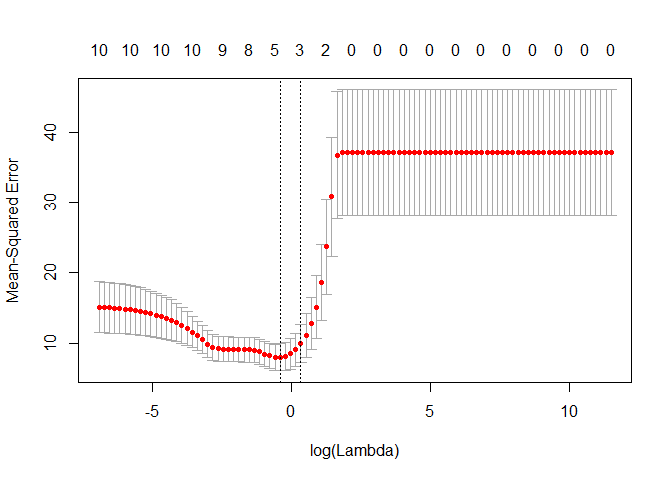

    # Best cross-validated lambda
    lambda_cv <- lasso_cv$lambda.min
    # Fit final model, get its sum of squared residuals and multiple R-squared
    model_cv <- glmnet(X, y, alpha = 1, lambda = lambda_cv, standardize = TRUE)
    y_hat_cv <- predict(model_cv, X)
    ssr_cv <- t(y - y_hat_cv) %*% (y - y_hat_cv)
    rsq_lasso_cv <- cor(y, y_hat_cv)^2

    # See how increasing lambda shrinks the coefficients --------------------------
    # Each line shows coefficients for one variables, for different lambdas.
    # The higher the lambda, the more the coefficients are shrinked towards zero.
    res <- glmnet(X, y, alpha = 1, lambda = lambdas_to_try, standardize = FALSE)
    plot(res, xvar = "lambda")
    legend("bottomright", lwd = 1, col = 1:6, legend = colnames(X), cex = .7)

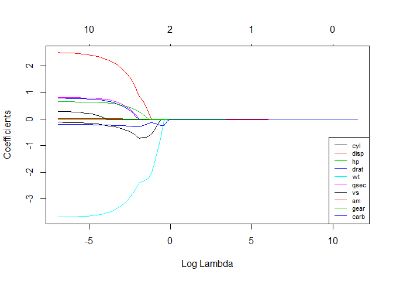

Ridge vs Lasso
--------------

Let us compare the multiple R-squared of various models we have
estimated!

    rsq <- cbind("R-squared" = c(rsq_ridge_cv, rsq_ridge_aic, rsq_ridge_bic, rsq_hridge_0001, rsq_lasso_cv))
    rownames(rsq) <- c("ridge cross-validated", "ridge AIC", "ridge BIC", "hridge 0.001", "lasso cross_validated")
    print(rsq)

    ##                       R-squared
    ## ridge cross-validated 0.8536968
    ## ridge AIC             0.8496310
    ## ridge BIC             0.8412011
    ## hridge 0.001          0.7278277
    ## lasso cross_validated 0.8426777

They seem to perform similarly for these data. Remember, that the
heteroskedastic model is untuned, and the lambda is not optimal! Some
more general considerations about how ridge and lasso compare:

-   Often neither one is overall better.
-   Lasso can set some coefficients to zero, thus performing variable
    selection, while ridge regression cannot.
-   Both methods allow to use correlated predictors, but they solve
    multicollinearity issue differently:
    -   In ridge regression, the coefficients of correlated predictors
        are similar;
    -   In lasso, one of the correlated predictors has larger
        coefficient, while the rest are (nearly) zeroed.
-   Lasso tends to do well if there are a small number of large
    parameters and the others are close to zero (ergo: when only a few
    predictors actually influence the response).
-   Ridge works well if there are many large parameters of about the
    same value (ergo: when most predictors impact the response).
-   However, in practice we don't know the true parameter values, so the
    previous two points are rather theoretical. Just run
    cross-validation to select the more suited model for a specific
    case.
-   Or... combine the two!

Elastic Net
-----------

Elastic Net first emerged as a result of critique on lasso, whose
variable selection can be too dependent on data and thus unstable. The
solution is to combine the penalties of ridge regression and lasso to
get the best of both worlds. Elastic Net aims at minimizing the
following loss funtion:

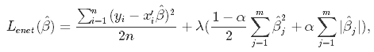

where *α* is the mixing parameter between ridge (*α* = 0) and lasso
(*α* = 1).

Now, there are two parameters to tune: *λ* and *α*. The *glmnet* package
allows to tune *λ* via cross-validation for a fixed *α*, but it does not
support *α*-tuning, so we will turn to *caret* for this job.

    library(caret)

    # Set training control
    train_control <- trainControl(method = "repeatedcv", 
                                  number = 5, 
                                  repeats = 5,
                                  search = "random",
                                  verboseIter = TRUE)

    # Train the model
    elastic_net_model <- train(mpg ~ ., 
                               data = cbind(y, X),
                               method = "glmnet",
                               preProcess = c("center", "scale"),
                               tuneLength = 25, 
                               trControl = train_control)

    # Check multiple R-squared
    y_hat_enet <- predict(elastic_net_model, X)
    rsq_enet <- cor(y, y_hat_enet)^2

Summary
-------

Congratulations! If you have made it up to this point, you already know
that:

-   If your linear model contains many predictor variables or if these
    variables are correlated, the standard OLS parameter estimates have
    large viariance, thus making the model unreliable.
-   To counter this, you can use regularization - a technique allowing
    to decrease this variance at the cost of introducing some bias.
    Finding a good bias-variance trade-off allows to minimize model's
    total error.
-   There are three popular regularization techniques, each of them
    aiming at decreasing the size of the coefficients:
    -   Ridge Regression, which penalizes sum of squared coefficients
        (L2 penalty).
    -   Lasso Regression, which penalizes sum of absolute values of the
        coefficients (L1 penalty).
    -   Elastic Net, a convex combination of Ridge and Lasso.
-   The size of the respective penalty terms can be tuned via
    cross-validation to find the model's best fit.
-   The R package implementing regularized linear models is *glmnet*.
    For tuning of the Elastic Net, *caret* is also the place to go to.
