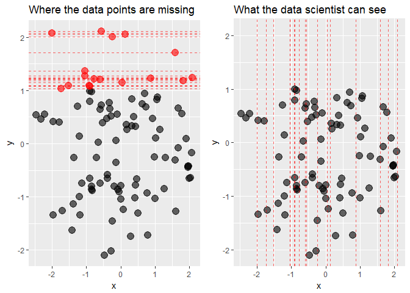
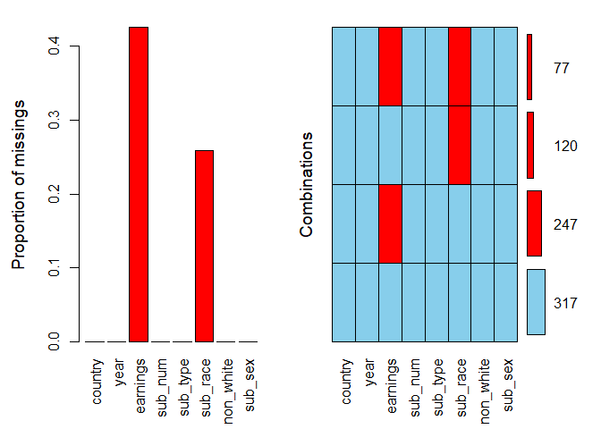
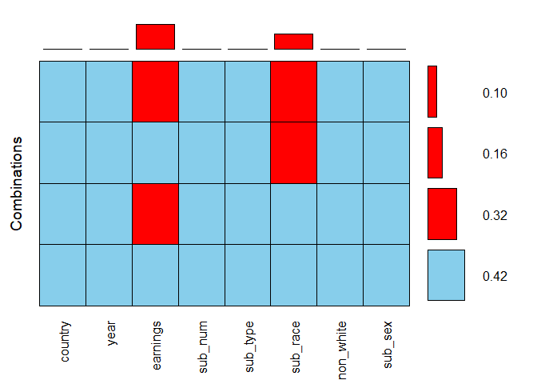
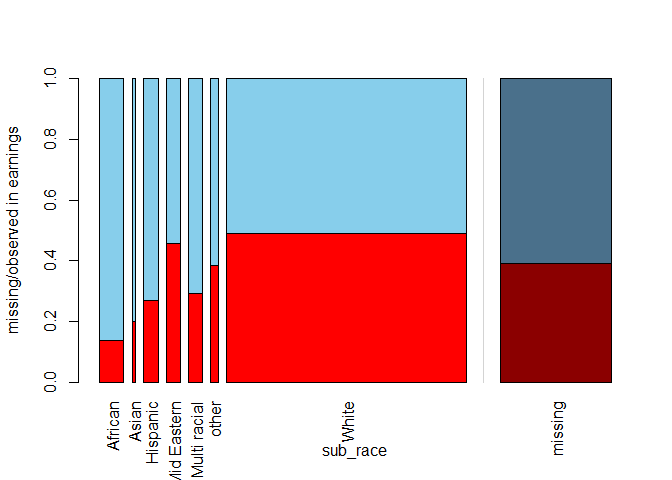
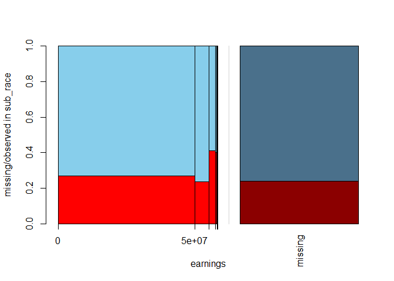
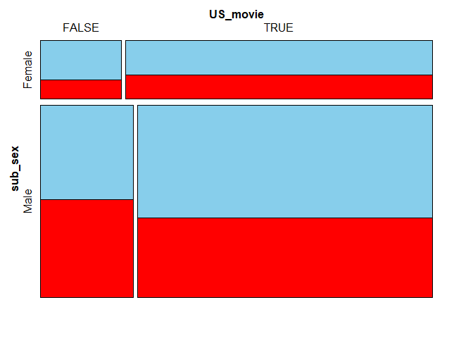
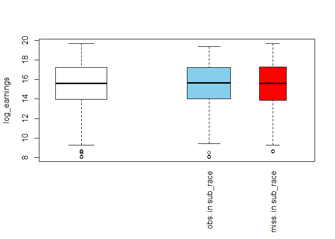
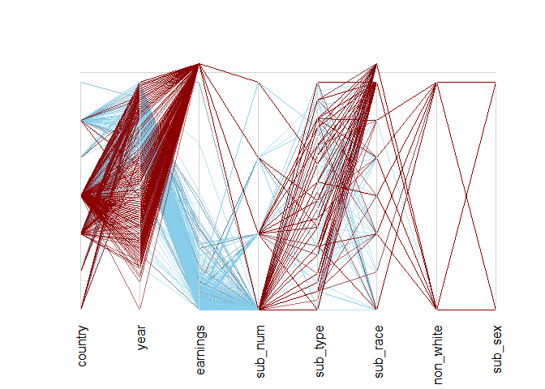
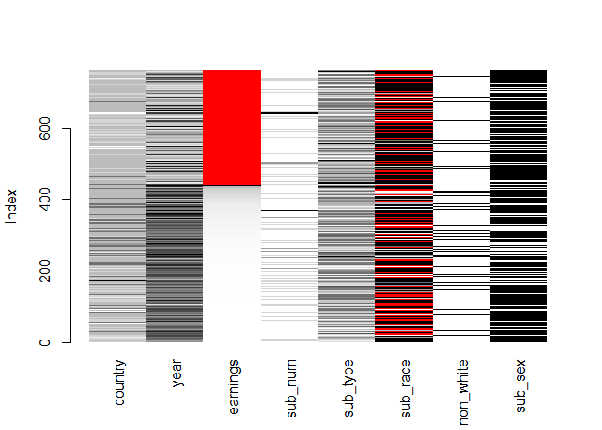

Learn to use data visualization tools provided by the VIM package to gain quick insights into the missing data patterns.
------------------------------------------------------------------------------------------------------------------------

Missing data pose a problem in every data scientist's daily work. Should
we impute them? If so, which method is appropriate? Or can observations
with missing data points simply be dropped? To answer these questions,
one would need to know what is the mechanism behind the missing data.
Detecting it with statistical tests is complex and sometimes only leads
to vague statements. Visualization tools, on the contrary, are easy to
use and help not only to detect missing data mechanisms but also to gain
insights into other aspects of data quality. In this tutorial, a set of
plotting methods available in the VIM package are presented to show how
they can help one get a solid grasp of what are the patterns in the way
data are missing.

Missing Data Mechanisms
-----------------------

There might be multiple reasons why a dataset is incomplete. It is
crucial to investigate what the possible causes of missing data could
be, as this can impact the way we tackle the problem. For instance, if
non-response in job-related surveys is the concern, one could expect the
very richest and the very poorest respondents not to disclose their
earnings in the questionnaire, which means the missing data points are
not spread out evenly over the dataset. If this is the case, simply
removing incomplete observations before performing the analysis of
interest would yield biased results. On the other hand, for example, if
data are missing due to a failure of the data collecting device, it
might be that the locations of the missing points in the dataset are
purely random.

There are three distinct patterns according to which the data can be
missing. They are typically referred to as missing data mechanisms.

-   **Missing completely at random (MCAR)**   Under MCAR there is
    no systematic pattern in the location of the missing data points in
    the dataset: they occur entirely at random. Formally, this means
    that the probability of an observation being absent depends neither
    on the values of other variables nor on its own values. In this
    case, dropping incomplete observations would not introduce bias to
    the results of the subsequent analysis.   **Example:**
    Temperature is continuously measured by a sensor that collects the
    data and sends them via the Internet to a database. Due to uknown
    reasons, the Internet connection breaks sometimes.

-   **Missing at random (MAR)**   Under MAR, the probability of a
    particular observation being missing is still independent on its own
    values, but it does depend on the values of other variables. In this
    case, removing incomplete observations makes the sample less
    representative.   **Example:** Some of the night-hours data are
    missing due to the sensor's maintenance works, which are always
    carried out overnight.

-   **Missing not at random (MNAR)**   Under MNAR, the probability
    of an observation being missing depends on its own unobserved
    values. In this case, again, dropping incomplete data leads to a
    biased analysis.   **Example:** Sensor freezes in -20 degrees
    Celcius and does not measure temperature below this value.

In practice, it is tough to tell which one of the three missing data
mechanisms applies in a specific case. To see this, let's plot some MNAR
data. We will use the `ggplot2` and `gridExtra` packages which we need
to load before. We will also load two other packages for later use:
`VIM` for visual analysis of missing data and `dplyr` for some data
pre-processing. Remember to `install.packages()` them first if they are
still missing in your workspace.

    library("VIM")
    library("dplyr")
    library("ggplot2")
    library("gridExtra")

Let's create a dataset with two uncorrelated, normally distributed
variables, x and y, with some missing values in y in the right tail of
its distribution, that is among its highest values. Note that we also
keep the actual values, and set them to missings in a separate variable.

    set.seed(2)
    mnar_data <- data.frame(x = rnorm(100), y = rnorm(100)) %>% 
      mutate(y_miss = ifelse(y > 1, y, NA),
             y = ifelse(is.na(y_miss), y, NA),
             x_miss = ifelse(is.na(y), x, NA))

We will now draw two scatter plots of x against y: one including the
points whose y-values we pretend to be missing and one with only
observed data.

    grid.arrange(
      # Plot highlighting missing data points
      ggplot(mnar_data, aes(x, y)) +
        geom_point(size = 4, alpha = 0.6) +
        geom_point(aes(x, y_miss), col = "red", size = 4, alpha = 0.6) +
        geom_hline(aes(yintercept = y_miss), col = "red", alpha = 0.6, 
                   linetype = "dashed") +
        ylim(NA, max(mnar_data$y_miss, na.rm = TRUE)) +
        ggtitle("Where the data points are missing"),
      # What data scientist can see
      ggplot(mnar_data, aes(x, y)) +
        geom_point(size = 4, alpha = 0.6) +
        geom_vline(aes(xintercept = x_miss), col = "red", alpha = 0.6, 
                   linetype = "dashed") +
        ylim(NA, max(mnar_data$y_miss, na.rm = TRUE)) +
        ggtitle("What the data scientist can see"),
      # Arrange the two plots side-by-side
      ncol = 2
    )

While from the first plot it is clear that the data are truly MNAR, what
the data scientist can see are only the x-coordinates of the missing
points. What conclusion can be drawn from the second plot? Are the data
MCAR? Possibly yes, the locations of missing values seem to be spread
out quite evenly over the x-axis. Or are they MAR? At a closer
inspection, there seem to be more missing values in y for negative
values of x than for the positive ones, so this can also be the case.
Finally, MNAR can never be ruled out, because to know if the data are
MNAR or not we would by definition need to observe the unobserved
values.  

Luckily, we do not need to be at a total loss here. Data visualization
tools can provide us with some guidance as to what patterns are there in
the missing data. We will now analyze a number of plots useful for
detecting those patterns based on the `biopics` dataset from the
`fivethirtyeight` package, containing some information about
biographical films.

Data Cleaning
-------------

Before moving on to the plotting part, the data needs some
pre-processing. The code chunk below will do the job. The `select` call
at the beginning of the dplyr pipeline extracts variables of interest
and the subsequent `mutate` groups related races together in order to
have enough observations in each group. Then, the class of some
variables is adjusted: we need factors for string variables and integers
for the logical one. Finally, the variables are renamed to shorter names
for the sake of plots' readability.

    data(biopics, package = "fivethirtyeight")

    biopics <- biopics %>% 
      select(country, year_release, box_office, number_of_subjects, 
             type_of_subject, subject_race, person_of_color, subject_sex) %>% 
      mutate(subject_race = ifelse(grepl("^Hispanic", subject_race), "Hispanic",
                                   subject_race),
             subject_race = ifelse(grepl("^African", subject_race), "African",
                                   subject_race), 
             subject_race = ifelse(grepl("^Middle", subject_race), "Mid Eastern",
                                   subject_race), 
             subject_race = ifelse(subject_race %in% c("White", "Asian", "African",
                                                       "Hispanic", "Mid Eastern",
                                                       "Multi racial", NA), 
                                   subject_race, "other")) %>% 
      mutate(country = as.factor(country),
             type_of_subject = as.factor(type_of_subject),
             subject_race = as.factor(subject_race),
             subject_sex = as.factor(subject_sex),
             person_of_color = as.integer(person_of_color)) %>% 
      as.data.frame()

    colnames(biopics) <- c("country", "year", "earnings", "sub_num",
                           "sub_type", "sub_race", "non_white", "sub_sex")

We end up with a dataset consisting of eight variables:

-   `country` - film's country or countries of origin,
-   `year` - year of release,
-   `earnings` - gross earnings at U.S. box office,
-   `sub_num` - the number of subjects featured in the film,
-   `sub_type` - the occupation of the subject or reason for
    recognition,
-   `sub_race` - a race of the subject,
-   `non_white` - dummy variable that indicates person of color,
-   `sub_sex` - sex of subject.

Aggregation Plots
-----------------

The first, fundamental questions to ask would be: in which variables
observations are missing, and how many? **Aggregation plots** are a
useful tool for answering these questions. The one-liner below is all
you need.

    aggr(biopics, numbers = TRUE, prop = c(TRUE, FALSE))

We specify the argument `numbers = TRUE` to display the numbers on top
of the bars. The argument `prop` is a logical indicating whether the
proportion of missing values and combinations should be used rather than
the total amount. We set it to `TRUE` for the first plot and `FALSE` for
the second.

It is clear that missing values appear only in two variables: they
constitute over 40% of `earnings` and around 25% of `sub_race`. In the
combinations plot on the right-hand side, the grid presents all
combinations of missing (red) and observed (blue) values present in the
data. There are 317 complete observations, and in 77 rows both variables
are missing.

Looking at two plots at the same time might seem a little confusing, so
let's coerce the same information into a single visualization with the
following line of code.

    aggr(biopics, combined = TRUE, numbers = TRUE)

The `combined` argument allows for combining the two plots into one.
Here, the horizontal bars to the right of the grid show the frequencies
of the corresponding combinations, while the vertical bars on top of it
present the proportions of missing values in each variable. By adding up
the values of all possible combinations for `earnings`, so 0.32 and
0.10, we see that the overall proportion of missing values in this
variable, which we estimated to be over 40% based on the previous bar
plot, is in fact 42%.

Spinogram and Spineplot
-----------------------

So far we have gained some high-level overview of the missing data. It
is time to look closer at the interactions between specific variables.
**Spinogram** and **spineplot** allow to study the percentage of missing
values in one variable for different values of the other. If the latter
is a numeric variable, then we have to do with a spinogram; when it is
categorical, this visualization is referred to as a spineplot.

Both can be generated with the function `spineMiss()`, taking a
two-column dataframe as input. The first specified variable is the one
according to which the data are split. It is mapped onto the horizontal
axis of the plot. The second variable is the one who's missing data
pattern we are interested in. To see it in practice, let us create a
spineplot. We specify a categorical variable `sub_race` first, followed
be `earnings`, which you can read as: what is the percentage of missing
values in `earnings` for each category of `sub_race`?

    spineMiss(biopics[, c("sub_race", "earnings")])

The relative width of the bars for specific categories in `sub_race`
mirrors the frequency of this category in the dataset: for instance, in
a vast majority of the films the main subject is white. Within each bar,
the missing proportion of `earnings` is shown, while the shadowed bar on
the right-hand side presents this proportion for the whole dataset. It
seems that when the main subject is African, we are the most likely to
have complete earnings information.

By switching the order of the variables as in the code line below, we
can produce a spinogram answering the following, turned-around question:
what is the percentage of missing data in `sub_race` for different
values of `earnings`?

    spineMiss(biopics[, c("earnings", "sub_race")])

Because `earnings` is a numeric variable, its values are divided into
bins, where the widths of the bins correspond to the distribution of the
variable itself. The spinogram shows that `earnings` are highly
negatively skewed: only a couple of films made the highest profit.
Interestingly, for those blockbusters, we are most likely to miss
subject's race, as reflected by the highest red bar for the most
significant values of `earnings`.

Mosaic Plot
-----------

The spinogram and spineplot discussed above allow to study interactions
between two variables. This idea is generalized to more variables in the
form of a **mosaic plot**. This plot is a collection of tiles, wherein
each tile corresponds to a specific combination of categories (for
categorical variables) or bins (for numeric variables) of two or more
variables. Within each tile, the percentage of missing data points in
another variable is shown. In principle, mosaic plots can be created for
any number of variables, but they can get cluttered if you go for too
many. Also, they are more readable if the splitting variables are
factors and the ones with not too many levels.

Let us take a look at the missing proportion in `earnings` split by
`sub_sex` and `US_movie`. The latter, created in the code chunk below,
is a logical stating whether the United States where involved in the
film's production. We provide the three-variable data frame as the first
argument to `mosaicMiss()`. Argument `plotvars` set to a vector with
elements 1 and 2 means we want to split the data according to the first
two columns of this data frame. Setting `highlight` to 3 means that we
want the missing proportion of the variable in the third columns to be
shown inside the tiles.

    biopics <- biopics %>% 
        mutate(US_movie = ifelse(grepl("US", country), TRUE, FALSE))
    mosaicMiss(biopics[, c("sub_sex", "US_movie", "earnings")], highlight = 3, 
               plotvars = 1:2, miss.labels = FALSE)

Again, the sizes of the tiles correspond to the occurance frequencies of
given combinations in the dataset. For instance, the largest
bottom-right tile means that most movies feature a male subject and were
produced, at least partly, in the US.

When it comes to movies featuring a male as the main subject, the
earnings information is more likely to be missing for non-American
movies. On the other hand, if the main character is a female, the US
films have slightly more missing values in earnings. These differences
seem, however, too small to be deemed significant.

Parallel Boxplot
----------------

Another visualization type is a **parallel boxplot**. The idea behind it
is to split the dataset into two subsets: one with only observed values
of an incomplete variable and the other with only its missing values.
For both subsets, a boxplot of a chosen numeric variable is produced.
This allows you to check whether the distribution of the chosen variable
is affected by missing values the splitting variable.

To produce a parallel boxplot, we can use the `pbox()` function. We pass
only one argument: a two-column data frame. The boxplots will be drawn
of the variable in the first column, while the one in the second column
will be used for splitting. In the example below, we take the logarithm
of `earnings` as they are highly skewed and without this transformation,
the boxplot would resemble a single line.

    biopics <- biopics %>% 
      mutate(log_earnings = log(earnings))
    pbox(biopics[, c("log_earnings", "sub_race")])

The white box on the left-hand side shows the overall distribution of
`log_earnings`, while the blue and the red one show its distribution for
the subsets of observed and missing values in `sub_race`, respectively.
The relative width of the boxes reflects the sizes of the subsets on
which they are based: the wider blue box means there are more observed
than missing values in `sub_race`. Other than that, the two boxes look
similar to each other and also the the overall white box. This suggests
that missing race information has no impact on the distribution of
earnings.

Parallel Coorinate Plot
-----------------------

We have looked at single variables and their interactions. Let us now
turn to analysing all the variables in the dataset at once. The
visualization allowing to do so is the **parallel coordinate plot**. In
this plot, each variable is transformed to the same scale and
represented by a parallel axis. In the case of categorical variables,
the scale of the coordinate axis is broken down into a set of
equidistant points, one for each of the categories. Missing values are
placed above the vertical axes, outside of the plot area. Each line on
the plot corresponds to one observation in the data, with the line's
color denoting missing data in the selected variable.

We can produce the parallel coordinate plot with the `parcoordMiss()`
function. By default, it uses all variables present in the data frame
provided as its first argument. Setting `highlight` to `earnings` marks
the lines representing observations with a missing value in `earnings`
with a different color. Setting alpha-blending to 0.6 makes the lines
slightly transparent, increasing plot's readability.

    # Remove variables created for the previous plots
    biopics <- biopics %>% 
      select(- US_movie, - log_earnings)

    parcoordMiss(biopics, highlight = 'earnings', alpha = 0.6)

In the plot above, dark red lines denote observations with a missing
value in `earnings`. These highlighted observations seem to behave
differently than the rest of the data. In particular, only a few of them
correspond to the a second-highest level of `country`, which otherwise
encompasses many observations! It turns out to be US/UK movies (to see
this, just run `levels(biopics$country)` and look for last-but-one
value!).

Moreover, a quick inspection of the `year` axis reveals a spell
somewhere two-thirds of its height with less dark red lines crossing.
There seems to have been a time not so long ago when earnings data were
more complete. This suggests that both `country` and `year` might help
explain the distribution of missing values in earnings!

Matrix Plot
-----------

The last visualization tool we will inspect is a **matrix plot**. It
visualizes all cells of the data matrix by rectangles. Observed data are
shown in a continuous grey-black color scheme (the darker the color, the
higher the value), while missing values are highlighted in red. It's a
good practice to sort the data by one of the incomplete variables - it
makes the plot easier to interpret. The code chunk below does the job,
sorting by `earnings`.

    matrixplot(biopics, sortby = c('earnings'))

The plot validates some of the previous findings: the observations with
missing values in `earnings` tend to come from long ago (low value of
`year`) and also score low on `country` - this is denoted by the lighter
color of these two variables in the rows in which earnings are red.
Also, it looks like there are fewer movies with a non-white subject when
`earnings` are missing.

Conclusions
-----------

Summarizing, it seems that the missing data in the `biopics` dataset are
not MCAR. The locations of missing data points in `earnings` and
`sub_race` help explain each other, as proved by the spineplot and the
spinogram. Moreover, the matrix plot and parallel coordinate plot
suggest that `country`, `year` and `non_white` might also help to
explain the distribution of missing values in `earnings`. Therefore, it
is not a good idea to drop the incomplete observations, as this would
most probably introduce bias to our inference.

Final Thoughts
--------------

You've come a long way! Now you know what missing data mechanisms are
and how do they differ, and more importantly, how to make inference
about them with a variety of visualization tools. Good job! You are now
fully equipped to analyze your own incomplete datasets!
